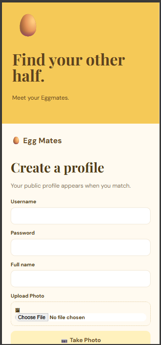
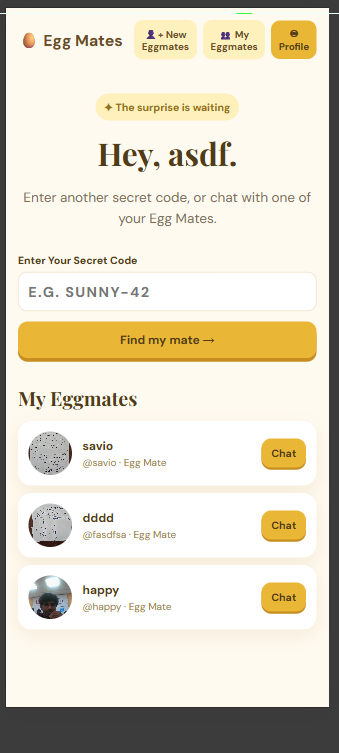
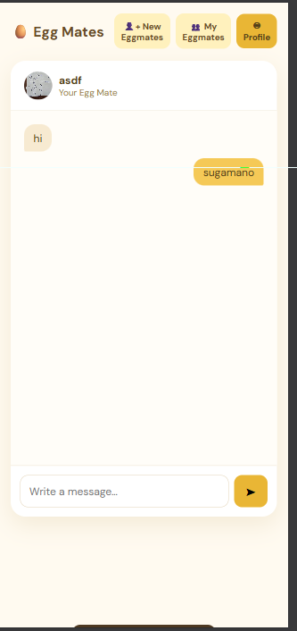
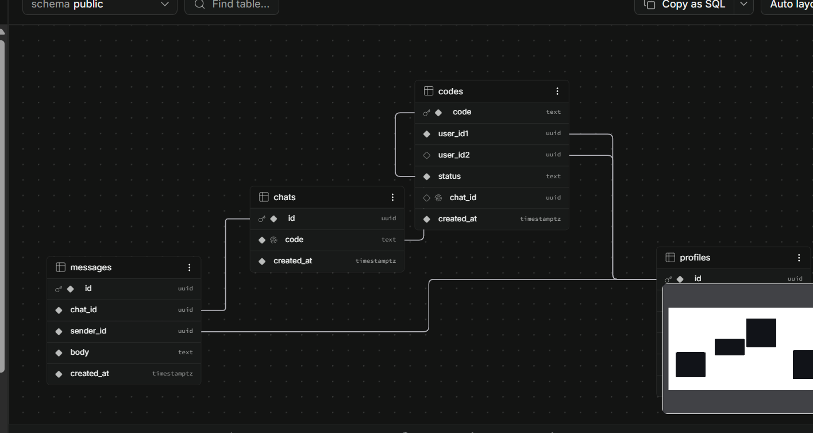

# Egg Mates 🥚

## Basic Details

### Team Name: Sphere

### Team Members

- Team Lead: Benjamin K James - College of Engineering, Chengannur
- Member 2: Aarone T George- College of Engineering, Chengannur

### Project Description

Have you ever wondered who eats the other half of the egg in your egg puffs?Egg Mates is a fun,
creative web platform that connects two strangers who unknowingly ate the two halves of the exact
same egg.
- [link of project](https://benjamin-kj.github.io/Eggmate/)

### The Problem (that doesn't exist)

Sometimes you eat an egg puff and are left wondering who was destined to eat your other half of the egg. Humanity deserved answers.

### The Solution (that nobody asked for)

1. The Hidden Stick: A food-grade wooden stick with a secret code is placed inside
the egg puffs during baking. The two halves of the same egg share the exact same
code.
2. Create Your Profile: When you find a stick, you visit the Egg Mates website. You
sign up with a username, password, name, personal photo, and a short bio.
3. Enter the Code: Log in with your username and password, then type in your secret
code.
4. Meet and Chat: Once the person who ate the other half of the egg logs in and
enters that same code, both of you can see each other's profiles and start chatting
directly on the website if you like! 

## Technical Details

### Technologies/Components Used

For Software:

- Languages used: HTML, CSS, JavaScript, SQL
- Frameworks used: None — lightweight browser-first web application
- Libraries used: Supabase JavaScript client, Google Fonts
- Tools used: Supabase, GitHub, VS Code / Live Server


### Implementation

For Software:

# Installation

1. Create a Supabase project.
2. Run [`supabase/migrations/001_egg_mates.sql`](./supabase/migrations/001_egg_mates.sql) in the Supabase SQL Editor.
3. Add your project URL and publishable/anon key to `supabase-config.js`.

```bash
git clone [your-repository-url]
cd [your-project-folder]
```

# Run

Serve the project with a local static server, such as VS Code Live Server, then open `index.html` in the browser.

```bash
python -m http.server 5500
```

Open `http://localhost:5500` in your browser.

## Project Documentation

For Software:

# Screenshots (Add at least 3)


*The Egg Mates sign-up screen, including profile-photo options.*


*A user enters a secret code to find their matching Egg Mate.*


*The real-time chat room created after a successful Egg Mate connection.*

# Diagrams


*Profiles are stored in Supabase, matching codes create independent connections, and each connection receives its own real-time chat room.*

For Hardware:

Egg Mates is a software-only project. A device camera is optionally used to capture a profile photo.

## Project Demo

# Video
https://drive.google.com/file/d/1kOLa1h0HFjGyFk6plXv_6SUJ9snrSzjc/view?usp=drivesdk

*The video should demonstrate creating a profile, entering a secret code, matching with an Egg Mate, the celebration effect, and real-time chat.*

# Additional Demos

- [GitHub Repository](https://github.com/Benjamin-KJ/Eggmate/)
- [Demo](https://drive.google.com/file/d/1kOLa1h0HFjGyFk6plXv_6SUJ9snrSzjc/view?usp=drivesdk)
- [landingpage](- [link of project](https://benjamin-kj.github.io/Eggmate/docs/)


## Team Contributions

- Benjamin K James:  Supabase database schema, secret-code matching, and real-time chat.
- Aarone T George: UI/UX, Physical prototype building for puffs, testing and real-time chat.


Made with ❤️ at TinkerHub Useless Projects
